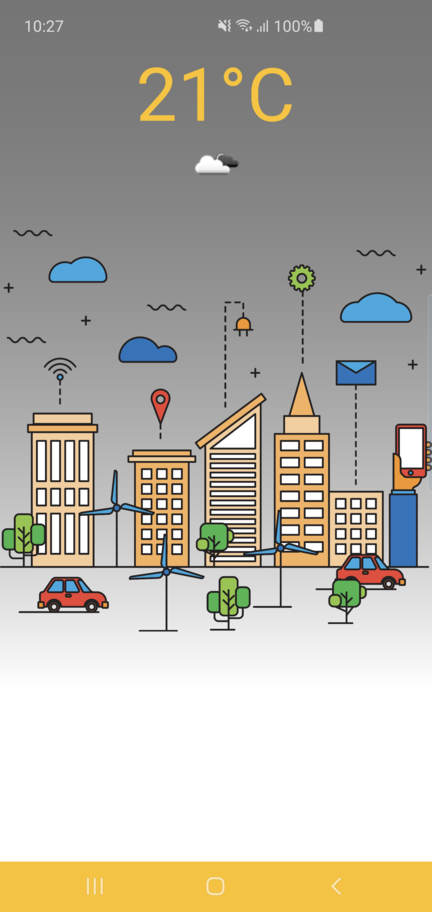

# Main Application of the project

Simple weather application using https://openweathermap.org/api

## Whats in there?

The project itself also contains 3 different implementations for the counter button example in different architectures. The libraries and project was build in 2018 so the
architecture and code might be obsolete.

